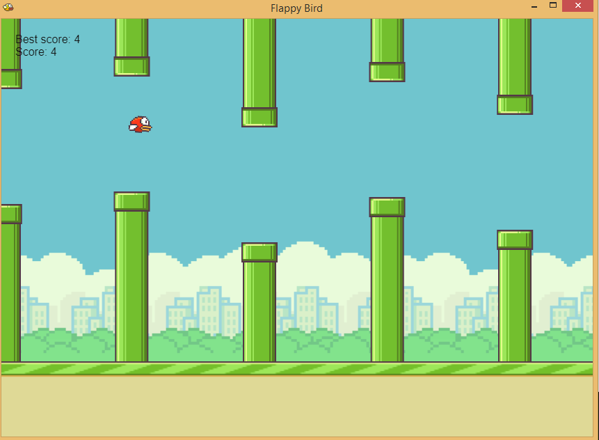

## Flappy bird clone for desktop application. 
Written in JavaScript with [Phaser.js](https://github.com/photonstorm/phaser) as the game framework and [Nw.js](https://github.com/nwjs/nw.js) as the underlying GUI application.



- [How to package your own program](#how-to-package)
	- [Prerequisite](#prerequisite)
	- [Step-by-step](#step-by-step)
	- [Final Note](#final-note)
- [TODO](#todo)

## <a name="how-to-package"></a> How to package your own program
### <a name="prerequisite"></a> Prerequisite
You probably don't need to have the exact same version, however it's advisable to.
- [Node.js v16.8.0](https://nodejs.org/).
- [Nw.js v0.58.0](https://nwjs.io/downloads/). Download sdk version if you're using it for development purpose. Sdk version bundled with chrome developer tools, on the other hand, regular version lacks developer tools which results in a smaller file size.
- [Phaser.js v3.55.2](https://github.com/photonstorm/phaser). You don't need to download it, since this repository already included with Phaser inside `src/lib/` folder. Well there's a weird bug whenever I want to define Phaser as Nw.js dependency, hence I don't include them inside manifest `package.json`.

### <a name="step-by-step"></a> Step-by-step:
1. Clone repository.
```bash
$ git clone https://github.com/robifr/flappy-bird.git
```
2. Create a new folder named with `nwjs` in the root directory folder.
3. Unzip the downloaded Nw.js sdk and put all the binary files inside `nwjs` folder. 

Here's my current working directory tree,
```
├── nwjs/
│  └── nwjs-sdk-v0.58.0-win-x64/
│      ├── locales/
│      ├── chromedriver.exe
│      ├── nw.exe
│      └── ...etc
├── src/
│   ├── assets/
│   ├── lib/
│   ├── server.js
│   ├── package.json (manifest)
│   └── ...etc
├── .gitignore
├── package.json (root)
└── ...etc
```
4. As you can see above, there are two `package.json`. The first one in the root folder, another one is manifest file inside `src/` folder. Install dependencies on both directory where root and manifest `package.json` file located.
```bash
$ npm install
```
5. If you're using OS other than Windows, please try to take a look [here](https://github.com/hisschemoller/nwjs-tutorial). **For Windows users**: 
	* Select and copy all files inside `src/` folder including `node_modules`, paste to `nwjs/nwjs-sdk-v0.58.0-win-x64/` folder, Where Nw.js binary files located. Make sure `nw.exe` and manifest `package.json` file have a same directory.
	* To make sure the application works correctly, try to run `nw.exe`. You can either click the file directly, drag-and-drop `package.json` into `nw.exe`, or run `nw.exe` from your terminal (assume you're using Command Prompt).
	```bash
	$ cd path/to/nwjs/nwjs-sdk-v0.58.0-win-x64
	$ nw.exe
	```
	* If it works then create an executable file called `flappybird.exe`.
	```bash
	$ copy /b nw.exe+package.json flappybird.exe
	```
	* And done. Whenever you want to launch the application, simply run `flappybird.exe`. You have to bring those folder which containing binary files and your `flappybird.exe` to make the application work.

### <a name="final-note"></a> Final Note
However that such a bad way to run the application especially for end-user, you have to bring all those cluttered files and folders together. If you want to create a single file which will bundle all the files and libraries into a standalone executable format, refer to [this link](https://github.com/hisschemoller/nwjs-tutorial), they will cover how to create your own installer.

## <a name="todo"></a> TODO
- Fix caching bug who are unable to read/write cache data when the application binary files are inside "Program Files x86" folder in Windows.
- Change the way Cache class to store data from plain object to built-in Map class.
